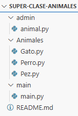

# 🐾 Superclase Animales  

Este proyecto en **Python** demuestra el uso de **herencia y polimorfismo** en la **Programación Orientada a Objetos (POO)** mediante una superclase llamada `Animal` y varias subclases (`Perro`, `Gato`, `Pez`) que heredan de ella.  

El código ahora está **modularizado**, es decir, **cada clase se encuentra en un archivo separado**, lo cual mejora la organización, el mantenimiento y la reutilización del código.  

---

## 🧠 Descripción del programa  

El programa modela distintos tipos de animales mostrando cómo comparten comportamientos generales (como **moverse**) y al mismo tiempo poseen acciones únicas (como **hablar** y **jugar**) según su especie.  

El código permite:  
- Definir una **superclase `Animal`** con atributos y métodos comunes.  
- Crear **subclases específicas** (`Perro`, `Gato`, `Pez`) que heredan y redefinen comportamientos.  
- Ejecutar acciones con varios animales para demostrar el **polimorfismo**.  
- Mantener una **estructura modular**: cada clase está en su propio archivo `.py`.  

---

## 🧩 Estructura del proyecto  
📂 Superclase_Animales/
│

├── animal.py # Define la clase base Animal

├── perro.py # Define la subclase Perro

├── gato.py # Define la subclase Gato

├── pez.py # Define la subclase Pez

└── main.py # Contiene la función principal del programa


---

## 🦴 Clase `Animal` (`animal.py`)

La clase `Animal` actúa como **superclase**.  
Define los atributos y métodos comunes a todos los animales.  

**Atributos:**  
- `nombre`: nombre del animal.  
- `tipo_movimiento`: forma en que el animal se desplaza (por ejemplo, correr o nadar).  

**Métodos:**  
- `hablar()`: método abstracto que será implementado por las subclases.  
- `moverse()`: imprime un mensaje indicando cómo se mueve el animal.  

```python
class Animal:
    def __init__(self, nombre, tipo_movimiento):
        self.nombre = nombre
        self.tipo_movimiento = tipo_movimiento
    
    def hablar(self):
        raise NotImplementedError

    def moverse(self):
        print(f"{self.nombre} empezó a {self.tipo_movimiento} a toda velocidad!!")

```

### 🐕 Clase `Perro`

La clase `Perro` hereda de `Animal` y define comportamientos propios de un perro.

**Métodos sobrescritos:**
- `__init__`: llama a `super()` con `tipo_movimiento="correr"`.
- `hablar()`: imprime un ladrido.
- `jugar()`: indica que el perro corre tras una pelota.

```python
from animal import Animal

class Perro(Animal):
    def __init__(self, nombre):
        super().__init__(nombre, tipo_movimiento="correr")

    def hablar(self):
        print(f"\n{self.nombre} dice Guauu!!!")

    def jugar(self):
        print(f"{self.nombre} está corriendo tras una pelota")
```


### 🐈 Clase `Gato`

La clase `Gato` hereda de `Animal` y redefine los comportamientos propios de un gato.

**Métodos sobrescritos:**
- `__init__`: llama a `super()` con `tipo_movimiento="correr"`.
- `hablar()`: imprime “Miau miau”.
- `jugar()`: indica que el gato corre tras un ratón de juguete.

```python
from animal import Animal

class Gato(Animal):
    def __init__(self, nombre):
        super().__init__(nombre, tipo_movimiento="correr")

    def hablar(self):
        print(f"{self.nombre} dice: ¡Miau miau!")

    def jugar(self):
        print(f"{self.nombre} está corriendo tras un ratón de juguete")
```


### 🐠 Clase `Pez`

La clase `Pez` hereda de `Animal` pero su tipo de movimiento es distinto (`nadar`).

**Métodos sobrescritos:**
- `__init__`: llama a `super()` con `tipo_movimiento="nadar"`.
- `hablar()`: simula sonido con burbujas.
- `jugar()`: indica que el pez persigue un renacuajo.

```python
from animal import Animal

class Pez(Animal):
    def __init__(self, nombre):
        super().__init__(nombre, tipo_movimiento="nadar")

    def hablar(self):
        print(f"{self.nombre} empezó a liberar burbujas como sonido")

    def jugar(self):
        print(f"{self.nombre} está persiguiendo un renacuajo")
```


## ⚙️ 4. Ejecución del programa (`main`)

El bloque `main()` crea instancias de las subclases, muestra ejemplos de reasignación de variables a distintos tipos y recorre una lista de animales para ejecutar comportamientos polimórficos.

**Pasos principales:**
1. Crear la lista principal de animales: `Perro("Mateo")`, `Gato("Michi")`, `Pez("Pipe")`.
2. Mostrar llamadas directas a métodos mediante reasignación (ej.: usar la variable `hamster` como `Perro` y luego como `Gato`).
3. Recorrer la lista y llamar a `hablar()`, `moverse()` y `jugar()` en cada objeto para evidenciar polimorfismo.

```python
# main.py
from perro import Perro
from gato import Gato
from pez import Pez

def main():
    # 1) Lista principal de animales
    animales = [Perro("Mateo"), Gato("Michi"), Pez("Pipe")]
    
    # 2) Ejemplos adicionales: reasignación de la variable 'hamster' a distintos tipos
    hamster = Perro("pepo")
    hamster.jugar()           # Perro.jugar()
    hamster = Gato("pepo")
    hamster.jugar()           # Gato.jugar()

    # 3) Demostración polimórfica: cada animal responde a los mismos métodos de forma diferente
    for animal in animales:
        animal.hablar()
        animal.moverse()
        animal.jugar()
        print()

if __name__ == "__main__":
    main()

```


## 🖥️ 5. Ejemplo de salida en consola



## 🧩 Conceptos de POO aplicados

| Concepto               | ¿Cómo se aplica en este proyecto?                                                                 |
|------------------------|---------------------------------------------------------------------------------------------------|
| **Herencia**           | `Perro`, `Gato` y `Pez` extienden la superclase `Animal`, heredando atributos y métodos comunes.  |
| **Polimorfismo**       | Llamadas idénticas (`hablar()`, `moverse()`, `jugar()`) producen comportamientos distintos según la subclase. |
| **Encapsulamiento**    | Los atributos (`nombre`, `tipo_movimiento`) se gestionan dentro de cada objeto y no se exponen globalmente. |
| **Responsabilidad única** | `Animal` define la interfaz y comportamientos generales; cada subclase implementa detalles concretos (hablar, jugar). |
| **Modularidad**        | Cada clase está en su archivo (`animal.py`, `perro.py`, `gato.py`, `pez.py`), mejorando organización y mantenimiento. |

---

## 👨‍💻 Autor

- **Miguel Ángel Ramos Sandoval**  

---
